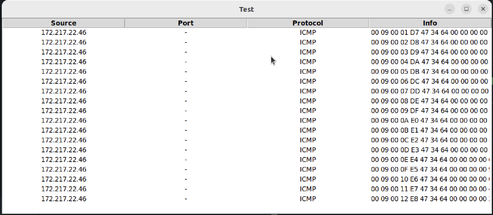

# EDR System - Packet Sniffer

This is a Python-based EDR (Endpoint Detection and Response) system that provides both a Command Line Interface (CLI) and a Graphical User Interface (GUI) to sniff packets based on markers such as TCP, UDP, ports, etc.

## Features

- Packets are parsed without external libraries.
- Sniff packets based on user-defined markers such as TCP, UDP, ports, etc.
- CLI and GUI interfaces for ease of use and flexibility.
- Captured packets viewing using a GUI

## Usage

Run as an administrator, and type help to view all relevant instructions and syntax

